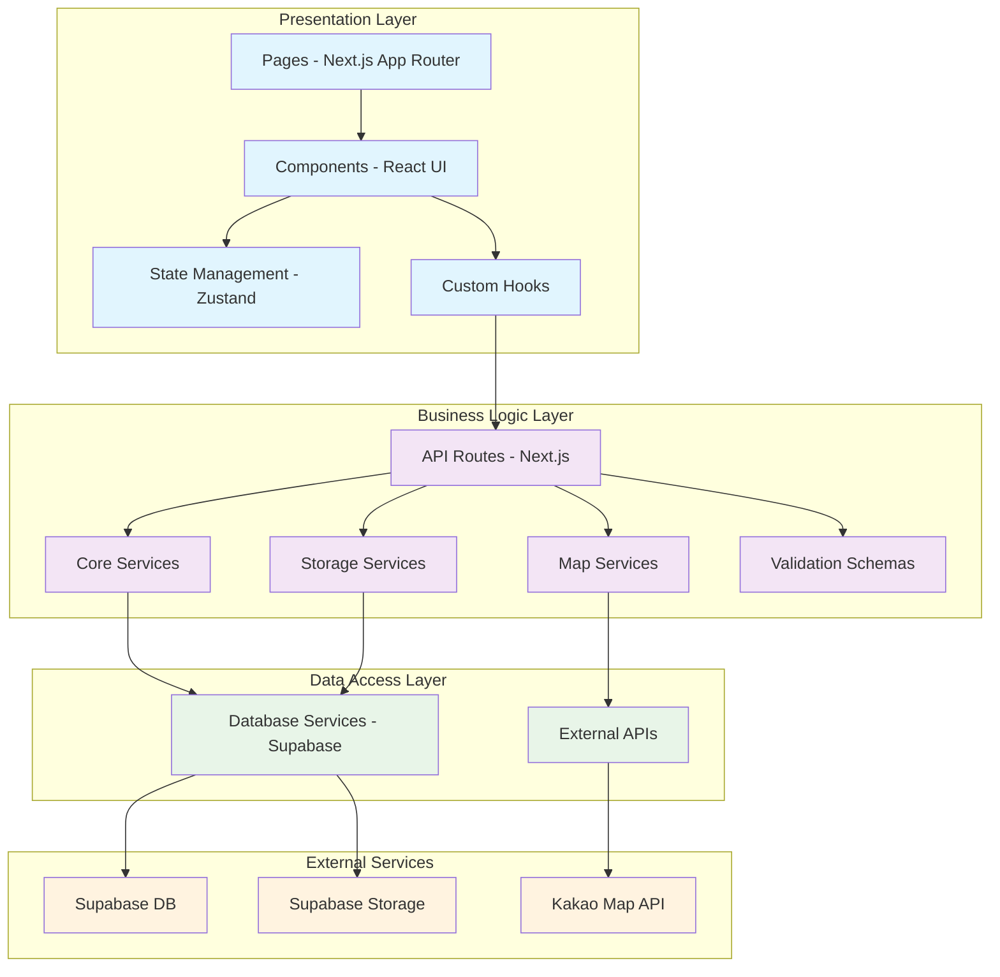

# 정당별 현수막 관리 시스템 모듈 설계

## 개요

| 모듈명 | 위치 | 설명 |
|--------|------|------|
| **API Layer** | `/src/app/api/` | Express 서버 역할의 Next.js API Routes |
| **Database Services** | `/src/lib/database/` | Supabase SDK를 활용한 데이터 액세스 계층 |
| **Map Services** | `/src/lib/map/` | Kakao Map API 연동 및 지도 관련 비즈니스 로직 |
| **Storage Services** | `/src/lib/storage/` | Supabase Storage를 활용한 파일 업로드/관리 |
| **Core Business Logic** | `/src/lib/services/` | 도메인별 비즈니스 로직 (정당, 현수막, 권한) |
| **Validation Schemas** | `/src/lib/validations/` | Zod를 활용한 입력 검증 스키마 |
| **Types & Interfaces** | `/src/types/` | TypeScript 타입 정의 |
| **Presentation Layer** | `/src/components/` | React 컴포넌트 및 UI |
| **Pages** | `/src/app/` | Next.js App Router 페이지 |
| **State Management** | `/src/store/` | Zustand를 활용한 전역 상태 관리 |
| **Hooks** | `/src/hooks/` | 커스텀 React 훅 |

## Diagram



## Implementation Plan

### 1. Types & Interfaces (`/src/types/`)

**구현 계획:**
- `index.ts`: 공통 타입 정의
- `party.ts`: 정당 관련 타입
- `banner.ts`: 현수막 관련 타입
- `auth.ts`: 권한 관련 타입
- `api.ts`: API 응답 타입

**Unit Tests:**
- 타입 호환성 검증
- 인터페이스 확장 테스트
- 제네릭 타입 검증

### 2. Validation Schemas (`/src/lib/validations/`)

**구현 계획:**
- `party.schema.ts`: 정당 CRUD 검증 스키마
- `banner.schema.ts`: 현수막 CRUD 검증 스키마
- `common.schema.ts`: 공통 검증 로직

**Unit Tests:**
```typescript
describe('Party Validation Schema', () => {
  it('should validate party creation input', () => {
    const validInput = { name: '테스트당', color: '#FF0000' };
    expect(() => partyCreateSchema.parse(validInput)).not.toThrow();
  });

  it('should reject invalid color format', () => {
    const invalidInput = { name: '테스트당', color: 'invalid' };
    expect(() => partyCreateSchema.parse(invalidInput)).toThrow();
  });
});
```

### 3. Database Services (`/src/lib/database/`)

**구현 계획:**
- `supabase.ts`: Supabase 클라이언트 설정
- `parties.service.ts`: 정당 데이터 액세스 계층
- `banners.service.ts`: 현수막 데이터 액세스 계층
- `audit.service.ts`: 감사 로그 관리

**Unit Tests:**
```typescript
describe('Parties Database Service', () => {
  it('should create party with valid data', async () => {
    const party = await createParty({ name: '테스트당', color: '#FF0000' });
    expect(party.id).toBeDefined();
    expect(party.name).toBe('테스트당');
  });

  it('should handle duplicate party name error', async () => {
    await expect(createParty({ name: '중복당', color: '#FF0000' }))
      .rejects.toThrow('Party name already exists');
  });
});
```

### 4. Map Services (`/src/lib/map/`)

**구현 계획:**
- `kakao.service.ts`: Kakao Map API 연동
- `geocoding.service.ts`: 주소-좌표 변환
- `administrative.service.ts`: 행정동 추출 로직

**Unit Tests:**
```typescript
describe('Geocoding Service', () => {
  it('should convert address to coordinates', async () => {
    const coords = await addressToCoordinates('서울시 강남구 테헤란로 123');
    expect(coords.lat).toBeCloseTo(37.498, 3);
    expect(coords.lng).toBeCloseTo(127.027, 3);
  });

  it('should extract administrative district', async () => {
    const district = await extractAdministrativeDistrict('서울시 강남구 삼성동');
    expect(district).toBe('삼성1동');
  });
});
```

### 5. Storage Services (`/src/lib/storage/`)

**구현 계획:**
- `supabase-storage.service.ts`: 파일 업로드/다운로드
- `image.service.ts`: 이미지 처리 및 썸네일 생성

**Unit Tests:**
```typescript
describe('Image Storage Service', () => {
  it('should upload image and return URL', async () => {
    const mockFile = new File(['test'], 'test.jpg', { type: 'image/jpeg' });
    const url = await uploadBannerImage(mockFile);
    expect(url).toMatch(/^https:\/\/.+\.jpg$/);
  });

  it('should generate thumbnail', async () => {
    const thumbnailUrl = await generateThumbnail('path/to/image.jpg');
    expect(thumbnailUrl).toContain('thumbnail');
  });
});
```

### 6. Core Business Logic (`/src/lib/services/`)

**구현 계획:**
- `party.service.ts`: 정당 관리 비즈니스 로직
- `banner.service.ts`: 현수막 관리 비즈니스 로직
- `auth.service.ts`: 권한 관리 로직
- `export.service.ts`: CSV/Excel 내보내기

**Unit Tests:**
```typescript
describe('Banner Service', () => {
  it('should create banner with complete workflow', async () => {
    const bannerData = {
      partyId: 'party-id',
      address: '서울시 강남구 테헤란로 123',
      text: '현수막 문구',
      startDate: '2024-01-01',
      endDate: '2024-01-31',
      image: mockFile
    };

    const banner = await createBanner(bannerData);
    expect(banner.lat).toBeDefined();
    expect(banner.lng).toBeDefined();
    expect(banner.imageUrl).toContain('https://');
  });

  it('should handle geocoding failure gracefully', async () => {
    const invalidData = { address: '존재하지않는주소123' };
    await expect(createBanner(invalidData))
      .rejects.toThrow('Geocoding failed');
  });
});
```

### 7. API Layer (`/src/app/api/`)

**구현 계획:**
- `parties/route.ts`: 정당 CRUD API
- `banners/route.ts`: 현수막 CRUD API
- `export/route.ts`: 데이터 내보내기 API

**Unit Tests:**
```typescript
describe('Parties API', () => {
  it('should return parties list', async () => {
    const response = await fetch('/api/parties');
    const data = await response.json();
    expect(response.status).toBe(200);
    expect(Array.isArray(data)).toBe(true);
  });

  it('should create party with valid data', async () => {
    const response = await fetch('/api/parties', {
      method: 'POST',
      body: JSON.stringify({ name: '신규당', color: '#00FF00' })
    });
    expect(response.status).toBe(201);
  });
});
```

### 8. State Management (`/src/store/`)

**구현 계획:**
- `party.store.ts`: 정당 상태 관리
- `banner.store.ts`: 현수막 상태 관리
- `ui.store.ts`: UI 상태 관리 (필터, 로딩 등)

**Unit Tests:**
```typescript
describe('Party Store', () => {
  it('should add party to store', () => {
    const { addParty, parties } = usePartyStore.getState();
    addParty({ id: '1', name: '테스트당', color: '#FF0000' });
    expect(parties).toHaveLength(1);
  });

  it('should update party in store', () => {
    const { updateParty, getParty } = usePartyStore.getState();
    updateParty('1', { name: '수정된당명' });
    expect(getParty('1')?.name).toBe('수정된당명');
  });
});
```

### 9. Custom Hooks (`/src/hooks/`)

**구현 계획:**
- `use-parties.ts`: 정당 데이터 관리 훅
- `use-banners.ts`: 현수막 데이터 관리 훅
- `use-map.ts`: 지도 상태 관리 훅
- `use-filters.ts`: 필터링 로직 훅

**Unit Tests:**
```typescript
describe('useParties Hook', () => {
  it('should fetch parties on mount', async () => {
    const { result } = renderHook(() => useParties());
    await waitFor(() => {
      expect(result.current.data).toBeDefined();
    });
  });

  it('should handle create party mutation', async () => {
    const { result } = renderHook(() => useParties());
    await act(async () => {
      await result.current.create({ name: '훅테스트당', color: '#0000FF' });
    });
    expect(result.current.data).toContainEqual(
      expect.objectContaining({ name: '훅테스트당' })
    );
  });
});
```

### 10. Presentation Layer (`/src/components/` & `/src/app/`)

**구현 계획:**
- 페이지: `dashboard`, `admin`, `map`
- 컴포넌트: `PartyForm`, `BannerForm`, `MapView`, `AdminTable`

**QA Sheet:**

#### PartyForm Component
| 테스트 케이스 | 예상 결과 | 실제 결과 | 통과/실패 |
|---------------|-----------|-----------|-----------|
| 정당명 입력 후 제출 | 새 정당 생성됨 | | |
| 중복 정당명 입력 | 오류 메시지 표시 | | |
| 잘못된 색상 코드 입력 | 검증 오류 표시 | | |
| 필수 필드 미입력 | 필드별 오류 메시지 | | |

#### BannerForm Component
| 테스트 케이스 | 예상 결과 | 실제 결과 | 통과/실패 |
|---------------|-----------|-----------|-----------|
| 이미지 업로드 | 미리보기 표시 | | |
| 주소 입력 시 자동완성 | 주소 목록 표시 | | |
| 종료일이 시작일보다 이전 | 날짜 검증 오류 | | |
| 모든 필드 입력 후 제출 | 현수막 생성됨 | | |

#### MapView Component
| 테스트 케이스 | 예상 결과 | 실제 결과 | 통과/실패 |
|---------------|-----------|-----------|-----------|
| 지도 초기 로딩 | 강남구 중심으로 표시 | | |
| 마커 클릭 | 상세 팝업 표시 | | |
| 정당별 필터 적용 | 해당 정당 마커만 표시 | | |
| 기간 만료 현수막 | 다른 색상으로 표시 | | |

#### AdminTable Component
| 테스트 케이스 | 예상 결과 | 실제 결과 | 통과/실패 |
|---------------|-----------|-----------|-----------|
| 목록 로딩 | 현수막 목록 표시 | | |
| 행정동 필터 | 해당 지역만 표시 | | |
| CSV 다운로드 | 파일 다운로드됨 | | |
| 수정/삭제 버튼 클릭 | 해당 기능 실행됨 | | |